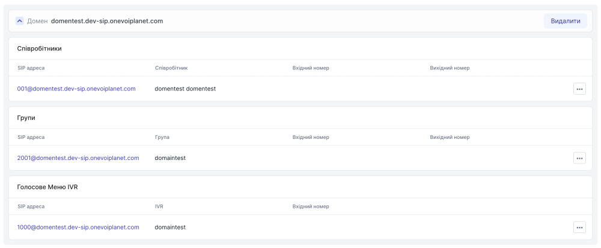
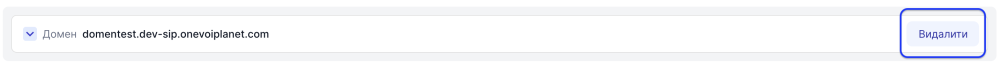

# Видалення SIP домену

Перед видаленням переконайтесь що до домену непривязано співробітників, груп, IVR, віджетів.

### Як переконатись що до домену непривязано співробітників, груп, IVR, віджетів?
1. Перейдіть до **SIP налаштування**

2. Натисніть **SIP Домени**

3. Перейдіть до бажаного домену та переконайтесь що до домену непривязано співробітників, груп, IVR, віджетів.

### Як видалити SIP домен?
Зверніть увагу, що **головний** домен видалити неможливо.

1. Перейдіть до **SIP налаштування**

2. Натисніть **SIP Домени**

3. Натисніть **Видалити** для домену який необхідно видалити

4. У модальному вікні натисніть **Видалити** для підтвердження дії

Домен успішно видалено.