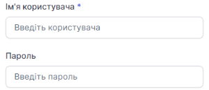
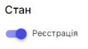

# Створення SIP Транку

### Як створити SIP домен?
1. Перейдіть до **SIP налаштування**

2. Натисніть на **SIP Транки**

3. Натисніть на **Додати SIP Транк**

4. В полі **Назва транку** ввести назву транка

5. В полі **Ім'я користувача** зазначається SIP адреса, наприклад 000. І в полі **Пароль** вказується пароль поточного SIP.

6. В полі **Хост** вести ім'я своего хоста(домена), наприклад, c000.sip.onevoiplanet.com. Також при необхідності можна вказати порт

Данні про обліковий запис SIP можна знайти на сторінці [Редагування співробітника - Обліковий запис SIP](../../employees-groups/employees/edit-employee.md#обліковий-запис-sip)

7. Можна перевірити з'єднання через кнопку **Перевірити підключення**

Якщо дані введено правильно, статус з'єднання змінеться на **Підключено**

8. Активувати транк через перемикач

Активація транку здійснюється тільки через підключення зовнішнього номеру

[Підключення зовнішнього номеру](../../numbers/external-numbers/add-external-numbers.md)

9. Натисніть кнопку **Додати**

SIP Транк успішно доданий

