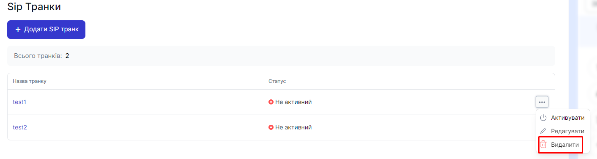

# Видалення SIP транку

При видаленні SIP Транку, видаляється зовнішній номер до якого був прив'язаний SIP Транк 

### Як видалити SIP Транк?

1. Перейдіть до **SIP налаштування**

2. Натисніть на **SIP Транки**

3. Натисніть на кнопку ... поточного SIP транку і виберіть пункт **Видалити**

4. В модальному окні натисніть **Видалити**

