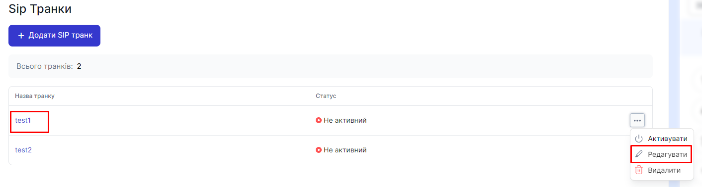
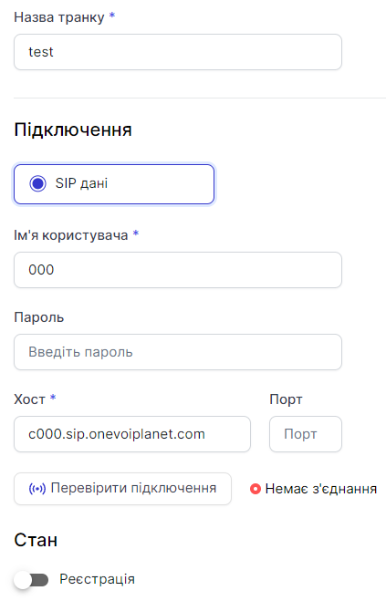

# Редагування SIP Транку

## Як редагувати SIP Транк?

1. Перейдіть до **SIP налаштування**

2. Натисніть на **SIP Транки**

3. Натисніть на назву SIP транка або натисніть кнопку ... і виберіть пункт **Редагувати**

## Редагувати SIP Транк

Ви можете редагувати поточний SIP Транк

4. Щоб зберегти дані, натисніть **Зберігти**

