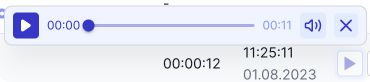

# Аудіозапис розмов

Якщо ви ввімкнули аудіозапис розмов у налаштуваннях компанії, ви зможете прослуховувати записи в журналі дзвінка.

Аудіозапис розмови буде доступним через 5 хвилин після завершення дзвінка.

Зберігання аудіозаписів дзвінків доступне протягом усього часу користуванням акаунту OneVOIPlanet.

## Як прослухати аудіозапис розмови?

1. Натисніть кнопку відтворення аудіозапису.

.

2. У медіа-плеєрі ви можете прослухати аудіозапис, увімкнути з певного моменту, змінити гучність та закрити медіа-плеєр.

## Як завантажити аудіозапис розмови?

1. Натисніть кнопку завантаження аудіозапису.

.

Завантажений файл потрапляє до папки **Завантаження** на ваш комп'ютер.