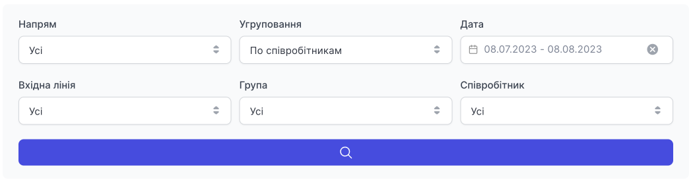
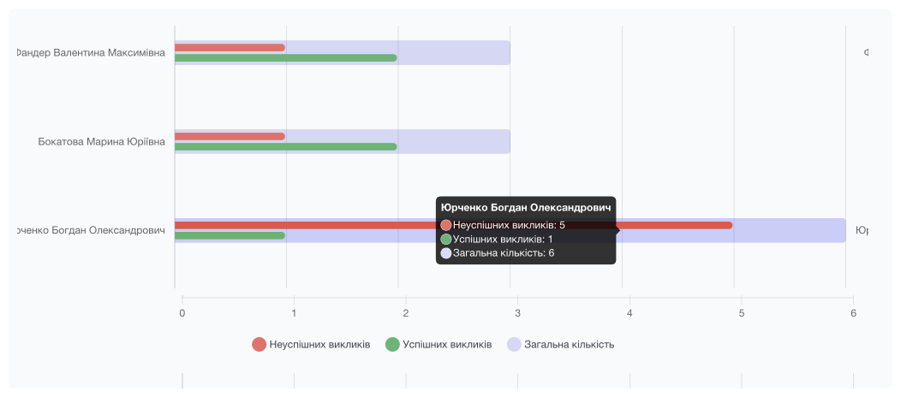
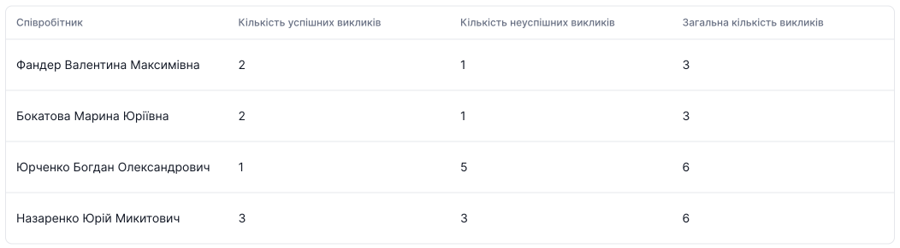

# Оцінка ефективності роботи

Показує кількість дзвінків за напрямками, зовнішними лініями АТС, групами та співробітниками, дозволяючи визначити динаміку їх змін або порівняти між собою.

Є фільтрація за:

- **Напрямок** (усі, вхідні, вихідні)
- **Угруповання** (по співробітниках, по днях)
- **Дата** (за день, за період часу). Неможливо вибрати період часу більше 30 календарних днів.
- **Вхідна лінія** (номер)
- **Група** (всі або фільтр за певною групою)
- **Співробітник** (усі або фільтр за певним співробітником)

**Графік відображення ефективності роботи співробітників/груп:**

Тут ви можете побачити співробітників/групи та наводячи на лінію, відображається модальне вікно з переліком успішних, не успішних, всіх дзвінків за обраний Вами період та іншими пунктами фільтрації.

Для роботи з великою кількістю даних, або з фільтрацією **Угрупування по днях**, зручніше дивитися в таблицю, розміщену нижче.

