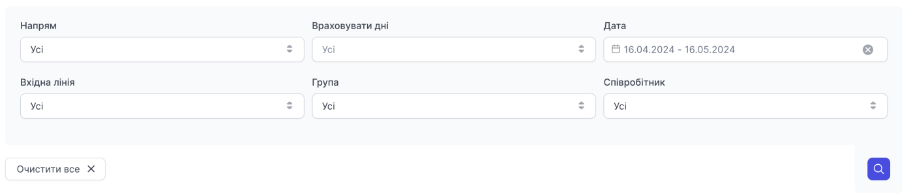
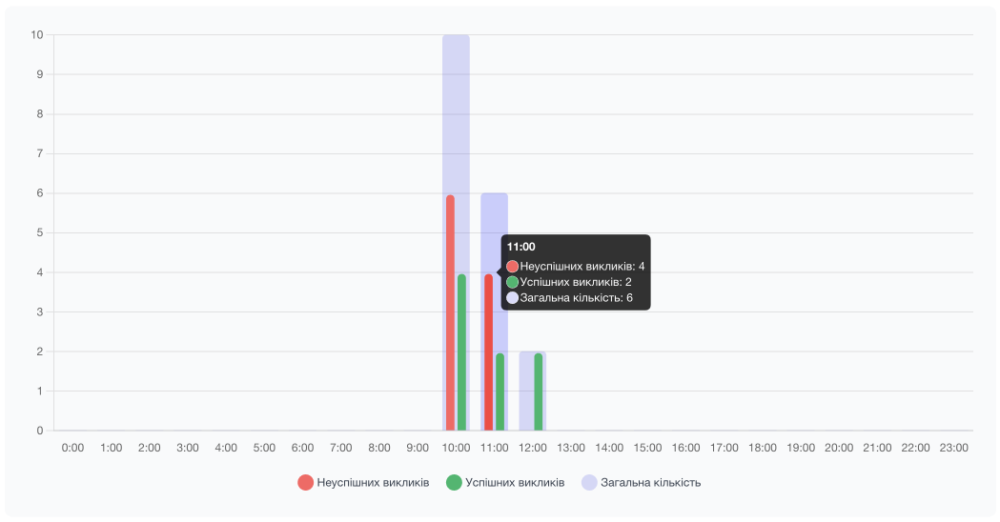
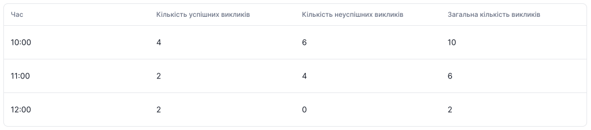

# Навантаження по годинах

Показує розподіл дзвінків за часом доби, дозволяючи виділити години пікового навантаження на компанію, групи чи співробітників за кількістю дзвінків.

Є фільтрація за:

- **Напрямок** (всі, вхідні, вихідні)
- **Дата** (на день, за період часу). Більше 30 календарних днів неможливо вибрати.
- **Вхідна лінія** (Понеділок, вівторок, середа, четверг, п'ятниця, субота, неділя)
- **Група** (Всі або фільтр за певною групою)
- **Співробітник** (Всі або фільтр за певним співробітником)

**Графік відображення навантаження по годинах:**

На якому ви можете бачити перелік часів та наводячи на лінію, відображається модальне вікно з переліком успішних, не успішних, всіх дзвінків за обраний Вами період та іншими пунктами фільтрації.

