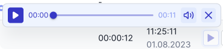
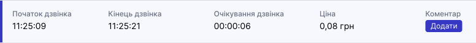

# Журнал дзвінків

Журнал дзвінків на головній сторінці відображає дзвінки, що були здійснені за сьогоднішній день.

Щоб переглянути повний журнал дзвінків:

1. Натисніть **Статистика**.

2. Перейдіть до **Журналу дзвінків**.

Для ролей **Адміністратор** та **Супервайзер** доступна повна статистика з дзвінками всіх операторів.

Співробітникам з ролями **Оператор**, **Бухгалтер** доступні лише їх власні журнали дзвінків.

У таблиці Ви можете відстежити:

- **Тип дзвінка**
- **Статус**
- **Хто звонив**
- **Кому дзвонили**
- **Тривалість**
- **Час та дата**

## Тип дзвінка

-  Вхідний
-  Вихідний

## Статус

Статуси дзвінка дозволяють визначити, у якому стані знаходиться дзвінок.

-  Дзвонили та дзвінок був прийнятий оператором
-  Телефонували і телефон абонента вимкнений або недоступний
-  Дзвонили та абонент скинув
-  Дзвонили абоненту і без відповіді
-  Оператор здійснив дзвінок та скинув
-  Пропущений виклик
-  Передзвонили на пропущений дзвінок
-  Невідома помилка
-  Спілкувалися і помилка мережі
-  Дзвінок йде в процесі (гудки)
-  Спроба підключення до оператора
-  Обрив дзвінка через відсутність вільних каналів
-  Пропущений дзвінок від абонента в офлайн стані

## Хто дзвонив

У цій колонці відображається ПІБ, номер телефону або SIP-адреса того, хто телефонує.

Якщо ви заздалегідь додали номер телефону клієнта в **Контакти**, то буде відображено назву контакту та його номер.

 - іконка, яка визначає, хто закінчив розмову.

## Кому дзвонили

У цій колонці відображається ПІБ, номер телефону або SIP-адреса кому телефонують.

 - іконка, яка визначає, хто закінчив розмову.

## Тривалість

 

У цій колонці відображається час розмови з моменту прийняття дзвінка.

## Година та дата

Відображення часу та дати коли був здійснений дзвінок.

## Коментар дзвінка

До кожного дзвінка можна залишити коментар. Максимальна кількість символів – 200 знаків.

Щоб залишити коментар:

1. Натисніть кнопку.

2. Біля поля коментар натисніть **Додати**.

3. Напишіть коментар та натисніть **Зберегти**.

Після додавання коментаря відбувається зміна кольору іконки та відображення внесеної інформації.

Коментарі можна редагувати або видаляти.

## Аудіозапис розмови

[Детальніше про аудізаписи розмов →](/statistics/audio-record)

## Розширені дані дзвінка

- **Початок дзвінка**
- **Кінець дзвінка**
- **Очікування дзвінка**
- **Ціна**

Ціна з'явиться через 5 хвилин після завершення дзвінка.

- **Коментар**

Для того, щоб переглянути розширені дані:

1. Натисніть кнопку 

Розкриється розширена інформація про дзвінок.

