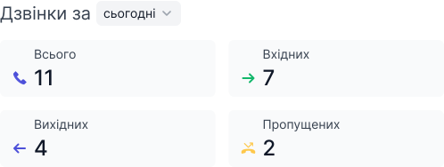
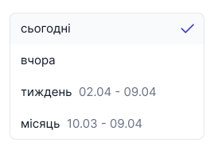
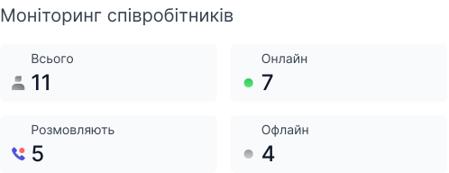

# Моніторинг дзвінків

На головній сторінці відображається моніторинг дзвінків та співробітників

Щоб побачити моніторинг дзвінків та співробітників:

1. Натисніть **Головна**

Для ролей **Адміністратор** та **Супервайзер** доступний моніторинг дзвінків та співробітників.

Для співробітників з ролями **Оператор**, **Бухгалтер** не відображається моніторинг дзвінків та співробітників.

### Моніторинг дзвінків

В моніторингу дзвінків ви можете відстежувати:

- Скільки було зроблено **всього** дзвінків
- Скільки було зроблено **вихідних** дзвінків
- Скільки було зроблено **вхідних** дзвінків
- Скільки було зроблено **пропущених** дзвінків

Також можна обрати потрібний період для відображення дзвінків

### Моніторинг співробітників

В моніторингу співробітників ви можете відстежувати:

- Скільки **всього** співробітників
- Скільки співробітників **онлайн**
- Скільки співробітників **офлайн**
- Скільки співробітників **розмовляють**

