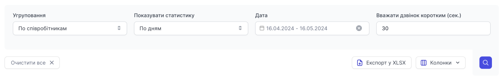

# Показники обслуговування

Показує основні KPI (показники обслуговування дзвінків клієнтів) співробітників та груп, дозволяючи робити висновки щодо якості їх роботи.

Перелік фільтрів:

- **Угруповання** (по співробітникам, по днях)
- **Показувати статистику** (по дням, по годинам)
- **Дата** (на день, за період часу)
- **Вважати дзвінком коротким (сек.)** (У цьому полі вказуйте кількість секунд розмови, яким вважати коротким)

Таблиця складається з таких пунктів:

- Дата
- Кількість успішних викликів
- Кількість пропущених викликів
- Відсоток пропущених викликів
- Середня швидкість відповіді, сек.
- Середній час розмови, сек.
- Загальний час дзвінків за цей період
- Відсоток коротких розмов
- Загальний час коротких розмов

Щоб переглянути показники обслуговування певного співробітника, натисніть іконку розвороту вниз біля ПІБ, щоб переглянути детальну інформацію.