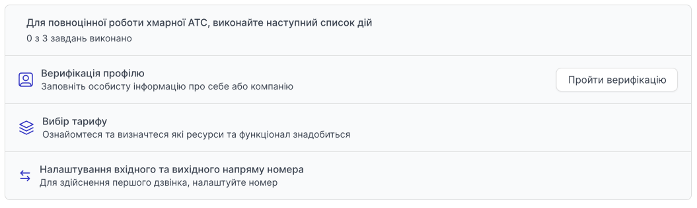

# Покрокове налаштування проекту

## Реєстрація та верифікація

1. [Пройдіть реєстрацію в особистому кабінеті →](https://cabinet.onevoiplanet.ua/registration)

[Інструкція як пройти реєстрацію фізичній особі →](/authorization-and-verification/registration/registration-individual)

Для повноцінної роботи хмарної АТС виконайте наступний список дій:

## Верифікація профілю

Заповніть особисту інформацію про себе або компанію.

[Докладніше про Верифікацію профілю →](/authorization-and-verification/verification/verification-individual)

## Вибір тарифу та покупка номерів

Ознайомтесь та оберіть  найзручніший для вас тариф, перейдіть до покупки номерів.

[Докладніше про Вибір тарифу та покупку номерів →](/finance/control-plan)

## Налаштування вхідного та вихідного напрямків номера

Для здійснення першого дзвінка — налаштуйте номер.

[Докладніше про Налаштування вхідного та вихідного напряму номера →](/call-processing/numbers/settings-number)

Після налаштування вхідного та вихідного напрямків номера, ви можете здійснювати дзвінки з особистого кабінету або взяти [дані облікового запису SIP](/employees-groups/employees/edit-employee#обліковий-запис-sip) і підключитися за допомогою SIP-пристроїв або SIP-додатків.