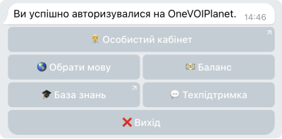

# Опис можливостей бота

В телеграм боті Ви можете:

- Перейти до особистого кабінету
- Обрати мову для бота
- Переглянути баланс Вашої компанії
- Перейти до бази знань
- Зв'язатись з техпідтримкою
- Отримувати повідомлення про нову відкладену заявку на віджет зворотного дзвінка
- Отримувати повідомлення про пропущений виклик
- Отримувати повідомлення про деактивацію компанії

Для того, щоб Ви могли використовувати усі ці можливості, необхідно під'єднати телеграм бота до користувача OneVOIPlanet

[Детальніше про те, як під'єднати телеграм бот до користувача →](../general-settings/notification-contacts/notification-telegram.md)

**Зверніть увагу!** Кнопка **Вихід** від'єднає користувача від телеграм бота, та скине усі налаштування.

