# Створення CallBack віджету
Перед тим, як створити CallBack віджет, переконайтеся, що маєте хоча б одного співробітника або групу з прихильністю до **вихідного напрямку**.   [Детальніше ознайомитися з налаштуванням вхідних та вихідних напрямків](/docs/call-processing/numbers/settings-number.md)

### Як створити CallBack віджет?

1. Натисніть **Віджети**.

2. Перейдіть до **CallBack**.

3. Натисніть **Створити Віджет**.

**Створення віджету зворотного дзвінка поділено на три етапи. На першому етапі Ви налаштовуєте загальні параметри віджету.**

1. Придумайте та введіть назву віджету.

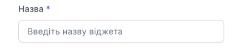

2. Введіть адресу сайта на якому буде розміщений віджет **без http://, без www**  Наприклад: **onevoiplanet.com**

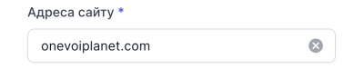

3. Виберіть стан віджет. **Увімкнений** тугл означає, що віджет буде активовано відразу після створення.

4. Виберіть співробітника або групу до якого буде направлено дзівнок

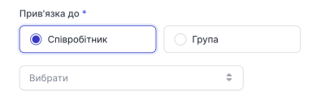

5. Налаштуйте робочі години за бажаним графіком отримання дзвінків

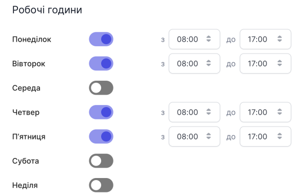

6. Виберіть додаткові налаштування відображення віджета:
- Відображати віджет при виході з сайту - коли користувач прибере курсор з сторінки сайту, йому буде запропоновано залишити свій номер та вибрати час для зворотнього дзвінка

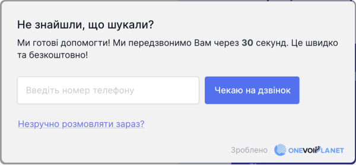

- Приховати віджет у неробочий час - віджет не буде відображатись на сайті у неробочій час

7. Натисніть **Продовжити**.

**На другому етапі Ви обираєте зовнішній вигляд віджету: вид та розмір кнопки, колір кнопки та блоку, розташування на сторінці та підписи блоку при різних ситуаціях.**

1. Виберіть тип та розмір кнопки (зараз в наявності тільки один тип кнопки)

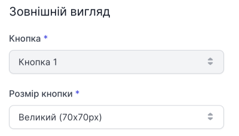

2. Налаштуйте чи буде у кнопки анімація

3. Виберіть колір кнопки та блоку (для кнопки є можливість вибрати колір з палітри)

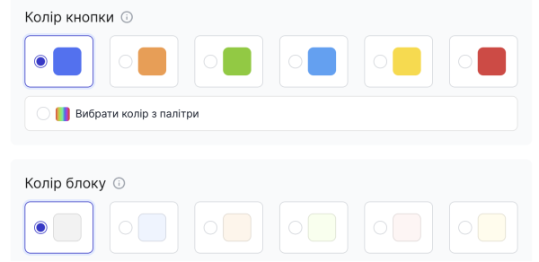

4. Виберіть як буде розташовуватись кнопка на сайті

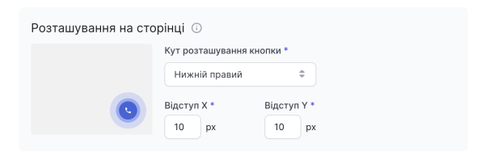

5. Налаштуйте підписи для різних випадків

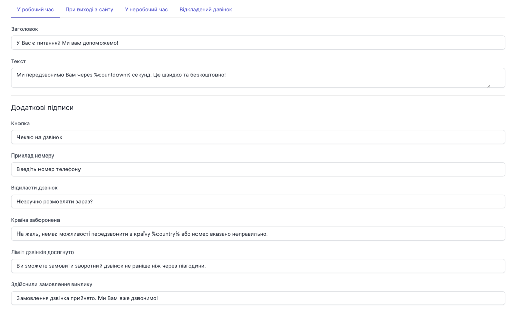

6. Натисніть **Продовжити**.

**На третьому етапі Ви обираєте критерії відображення віджету.**

1. Виберіть зворотній відлік часу який буде відображати максимальний час, через який клієнт отримує зворотній дзвінок

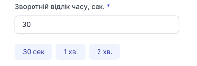

2. Налаштуйте через який час буде відображатись віджет після відкриття користувачем сайту (рекомендовано від 10 секунд)

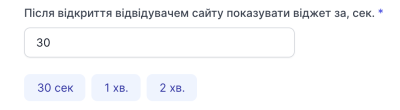

3. Виберіть кількість можливих заявок з одного IP

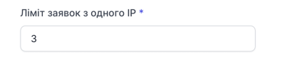

4. Натисніть **Створити**.

**Створення CallBack віджету завершено.**
