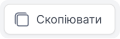

# Підключення CallSite віджету

### Як додати віджет до сайту?

Спочатку потрібно отримати код віджету. Існує два способу отримання коду:

1. Під час створення на останньому етапі після натискання кнопки **Створити**:
- У модальному вікні що з'явилося, натиснути кнопку **Код для сайту**.

- Натиснути **Скопіювати**.

2. При перегляді детальної інформації віджету:
- Натисніть **Віджети**.

- Перейдіть до **CallSite**.

- В таблиці виберіть лівим кліком по назві потрібний вам віджет

- Натисніть **Редагувати віджет**.

- Оберіть табу **Код для сайту**.

- Натиснути **Скопіювати**.

Код віджету треба додати як **останній скрипт в body до кореневого index.html файлу**

**Підключення CallSite віджету завершено.**