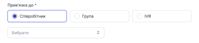
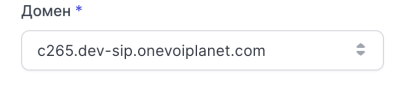
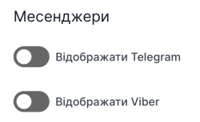
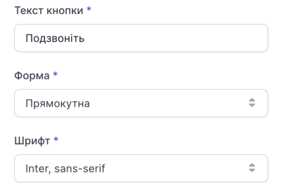
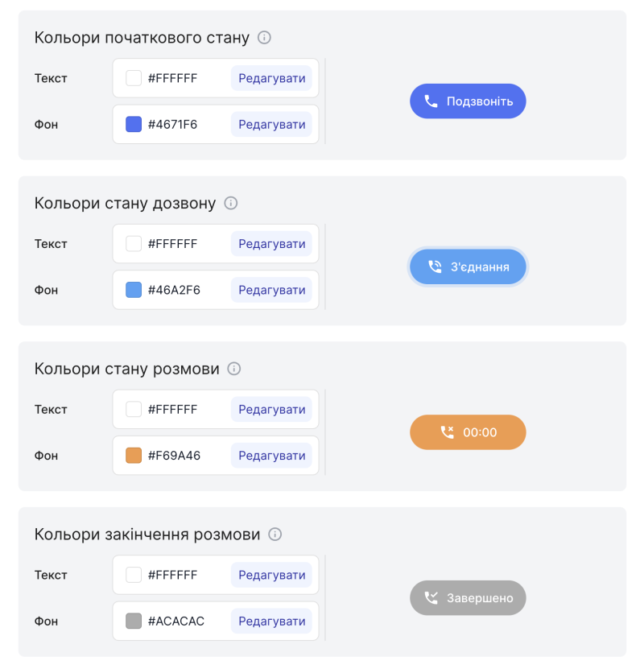

# Створення CallSite віджету

### Як створити CallSite віджет?

1. Натисніть **Віджети**.

2. Перейдіть до **CallSite**.

3. Натисніть **Створити Віджет**.

4. Придумайте та введіть назву віджету.

5. Виберіть стан віджет. **Увімкнений** тугл означає, що віджет буде активовано відразу після створення.

6. Виберіть співробітника, групу або IVR до якого буде направлено дзівнок

7. Виберіть домен до якого буде належати віджет. (**Зверніть увагу!** Змінити домен після створення віджету **неможливо**)

8. Виберіть месенджери які Ви бажаєте відоброжати

9. Виберіть текст кнопки, форму та шрифт

10. Виберіть колір віджету

11. Натисніть **Створити**.

**Створення CallSite віджету завершено.**
